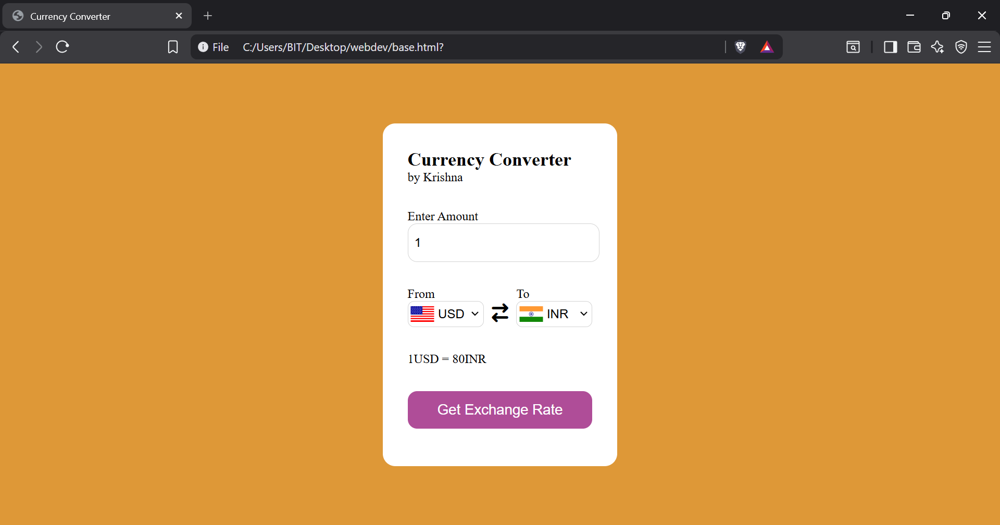
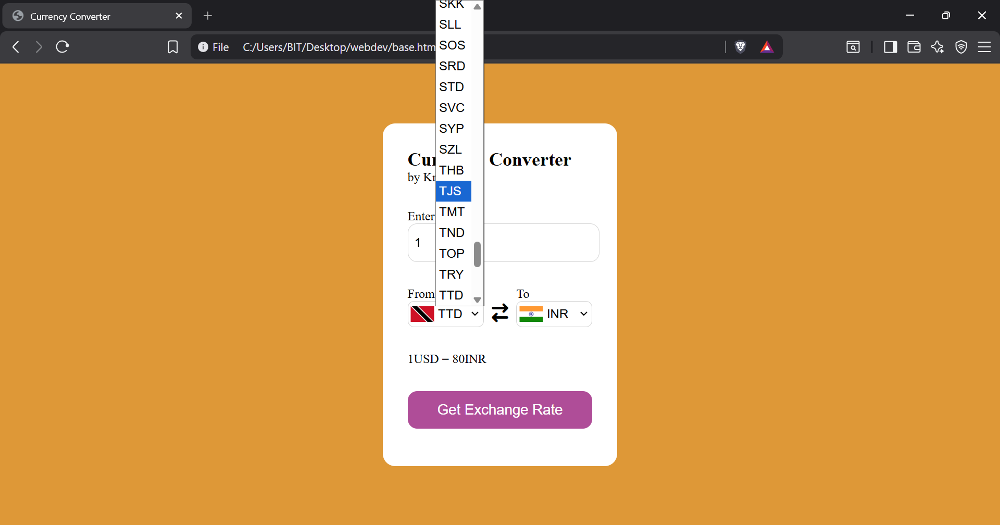

# Currency Converter

A responsive **Currency Converter** web application built using **HTML, CSS, and JavaScript**. The application enables users to convert an amount between different currencies using real-time exchange rates. It supports a wide range of international currencies and automatically updates country flags based on the selected currencies for an intuitive user experience.

---

## About Currency Converter

A currency converter is a financial tool that calculates the equivalent value of one currency in another using current exchange rates. It is commonly used for international travel, online shopping, business transactions, and financial planning. This project integrates a live exchange rate API to provide accurate and up-to-date currency conversions.

---

## Features

- Real-time exchange rate conversion
- Supports multiple international currencies
- Automatic country flag updates
- User-friendly and responsive interface
- Input validation for conversion amount
- Fast and lightweight frontend implementation
- Clean and modern design

---

## Technologies Used

- HTML5
- CSS3
- JavaScript (Vanilla JavaScript)
- Exchange Rate API
- Flags API

---

## Preview

### Homepage

### Currency Conversion

---

## How to Use

1. Open the application in your browser.
2. Enter the amount to be converted.
3. Select the source currency.
4. Select the target currency.
5. Click **Get Exchange Rate**.
6. View the converted amount instantly using the latest available exchange rate.

---

## Learning Outcomes

This project demonstrates practical implementation of:

- DOM Manipulation
- Event Handling
- Fetch API
- Asynchronous JavaScript (Async/Await)
- API Integration
- Dynamic UI Updates
- Form Validation
- Responsive Web Design

---

## Author

**Krishna Verma**

